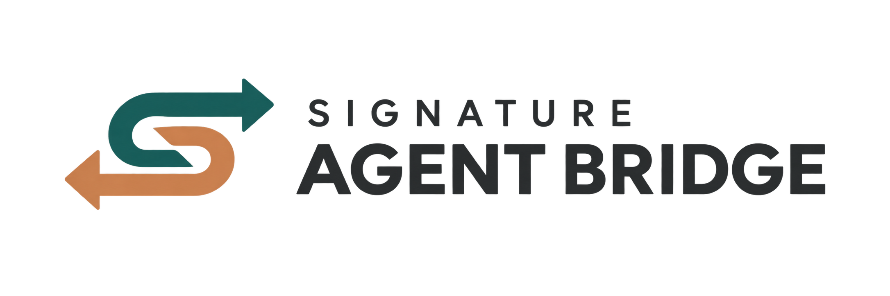
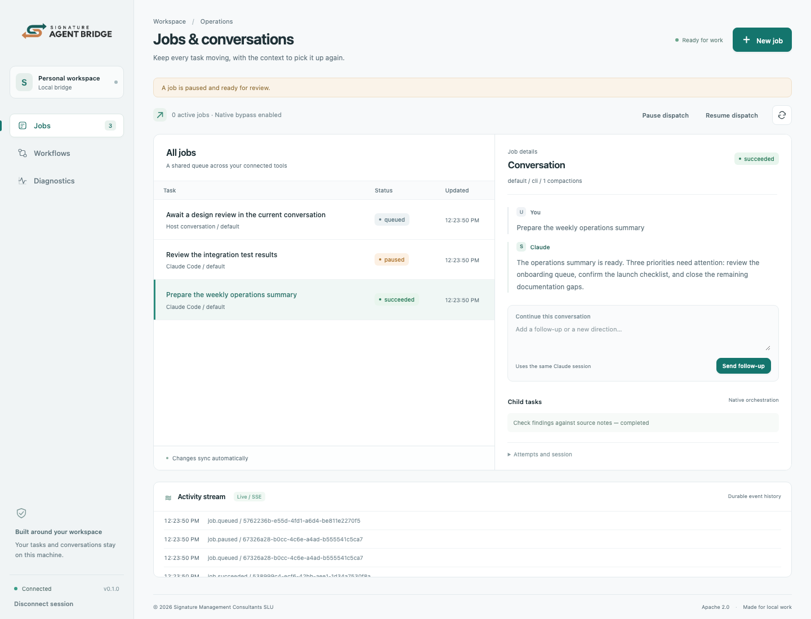
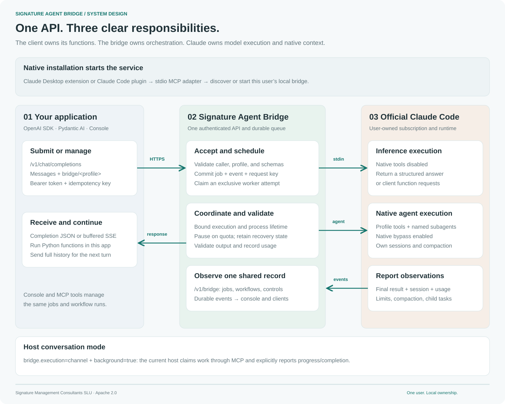
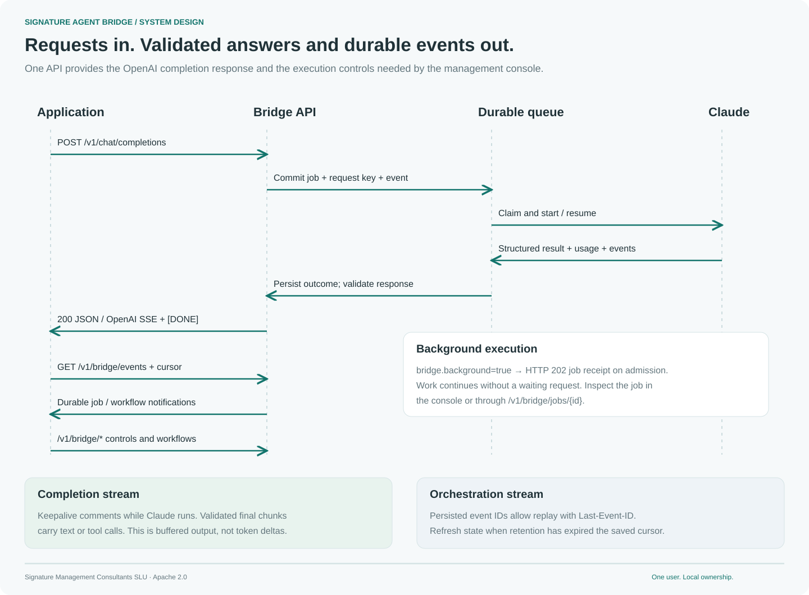
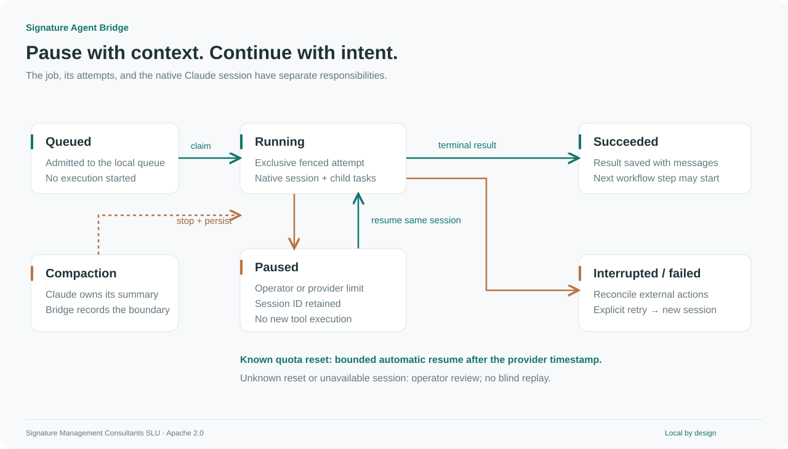
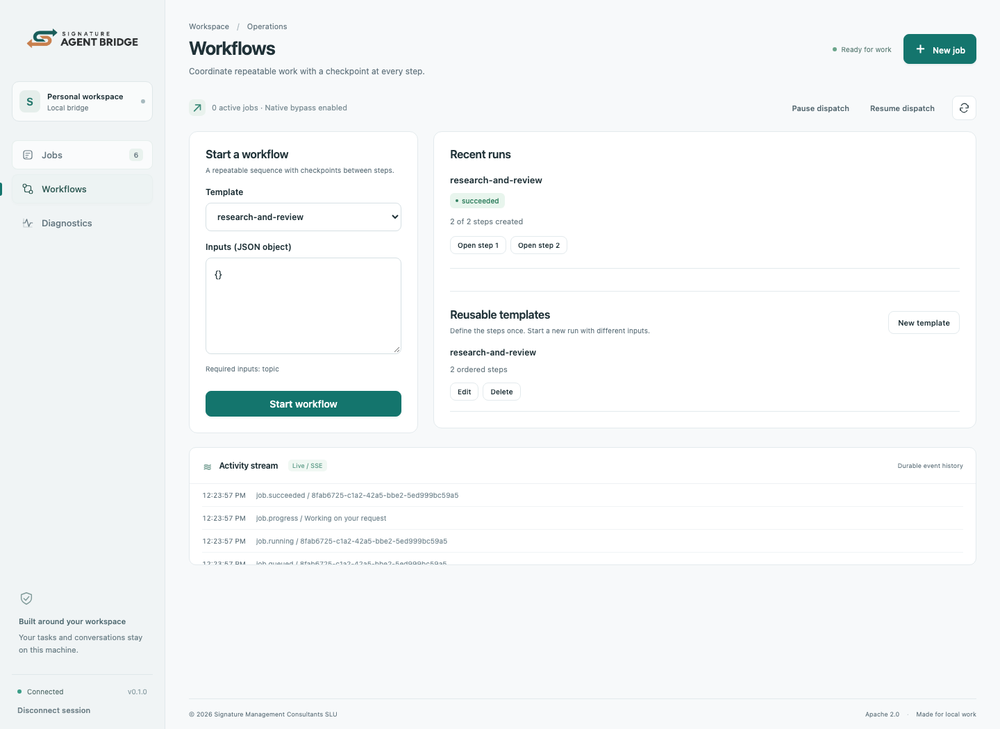
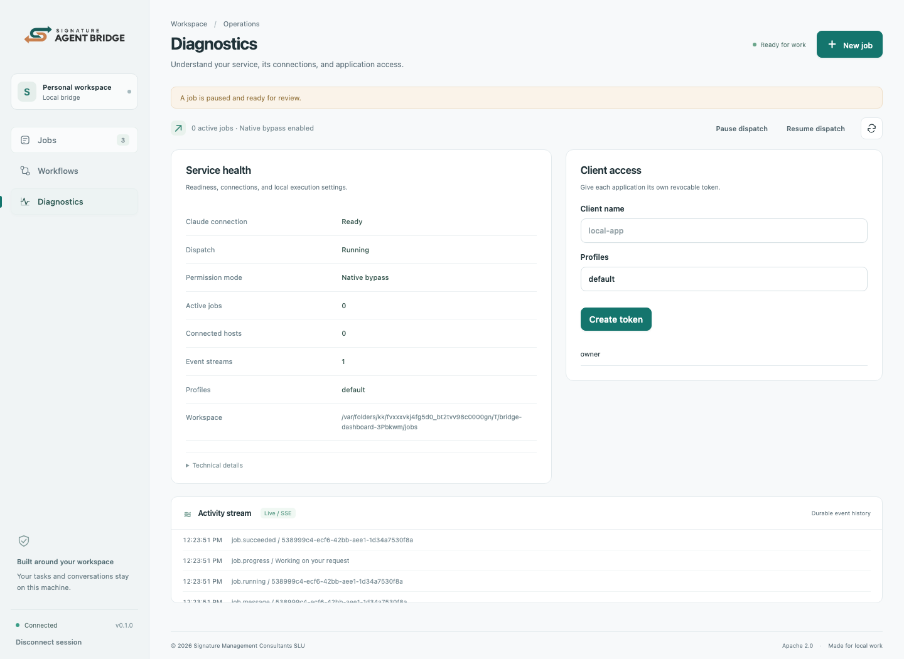

<p align="center">
  <picture>
    <source media="(prefers-color-scheme: dark)" srcset="assets/banner.png">
    
  </picture>
</p>
<p align="center"><strong>Your Claude subscription. A connected local workspace.</strong></p>
<p align="center">
  <a href="https://github.com/signature-organization/signature-agent-bridge/actions/workflows/ci.yml"></a>
  <a href="LICENSE"></a>
  <a href="https://github.com/signature-organization/signature-agent-bridge/releases/latest"></a>
</p>
<p align="center"><a href="#quickstart">Quickstart</a> · <a href="docs/architecture.md">Architecture</a> · <a href="docs/api.md">API & SSE</a> · <a href="docs/dashboard.md">Console tour</a> · <a href="docs/operations.md">Operations</a></p>

Signature Agent Bridge connects **Claude Desktop, Claude Code, and your applications** through a shared local job queue. Install the native integration, keep your own official Claude Code login, and manage work through conversation, an authenticated API, or a live web console.



_Screenshots show the running application with deterministic test data, not a mockup._

## Why this project exists

A conversation is a useful place to start work. It is not always enough to coordinate it.

Local scripts need a stable interface. Long tasks need a durable record. Workflows need checkpoints. When a conversation compacts or a subscription reaches a limit, the surrounding application needs to know what happened and how work can continue.

This project adds that coordination layer around the **unmodified official Claude Code executable**. Each person operates their own bridge with their own subscription. Authentication remains with Claude Code; the bridge does not collect Claude credentials or turn one account into a shared model service.

The motivation is practical: use the tools and subscription you already work with, while making local work observable, manageable, and recoverable.

## What you get

| Capability                  | Behavior                                                                                                        |
| --------------------------- | --------------------------------------------------------------------------------------------------------------- |
| Native installation         | A GitHub marketplace plugin for Code; a self-contained `.mcpb` extension for Desktop                            |
| Bidirectional communication | REST sends commands and follow-ups; SSE streams durable progress and results back                               |
| Durable jobs                | SQLite queue, scoped idempotency keys, fenced attempts, explicit cancellation and retries                       |
| Session continuity          | Native session IDs survive compaction and support pause/resume                                                  |
| Subscription limits         | Durable dispatch pause, provider reset timestamps, bounded automatic continuation, manual recovery when unknown |
| Workflows                   | Validated sequential templates, immutable run snapshots, step outputs, pause/resume and cancellation            |
| Native subagents            | Profile-defined agents, child-task observations and limits, parent-owned shutdown                               |
| Management console          | Jobs, conversations, workflows, diagnostics, application tokens, and live activity                              |
| Native bypass               | Worker jobs, workflow steps, and retries use `--dangerously-skip-permissions`                                   |
| Tunnel access               | Loopback listener with host/origin allowlists and scoped bearer authentication                                  |



[PNG version](assets/diagrams/architecture.png) · [Detailed architecture](docs/architecture.md)

## Quickstart

### Before installing either integration

Install [Claude Code](https://code.claude.com/docs/en/setup), then sign in with your own subscription:

```sh
claude --version
claude auth login
claude auth status
```

Use **Claude Code 2.1.260 or later**. Authentication must report `claude.ai` and a subscription. Remove API-key/provider overrides from the bridge environment. Release packages include their runtime; **Node.js is not required** for installation.

### Claude Code — install from GitHub

Run these commands inside Claude Code:

```text
/plugin marketplace add signature-organization/signature-agent-bridge
/plugin install signature-agent-bridge@signature-organization
```

Restart Claude Code so its MCP integration loads. On first load, the plugin downloads the pinned release for your platform, verifies the release checksum, and starts the shared listener. Windows users need Git Bash available as `bash`.

Then ask:

> Use Signature Agent Bridge to check its status. Submit a job that writes a short hello-world note, wait for the result, and show me the management panel.

The included skill is available as:

```text
/signature-agent-bridge:bridge
```

### Claude Desktop — install the extension

1. Download the matching `.mcpb` from the [latest release](https://github.com/signature-organization/signature-agent-bridge/releases/latest): `darwin-arm64` for Apple silicon, `darwin-x64` for Intel Macs, or `win32-x64` for Windows.
2. Open **Claude Desktop → Settings → Extensions → Advanced settings → Install Extension…** and select the file.
3. Enable the extension and complete any installation consent shown by Desktop.
4. Start a conversation and ask:

> Check Signature Agent Bridge status, submit a simple test job, and give me the dashboard URL.

The extension includes the service executable and starts it when Desktop activates its MCP server. Desktop uses the locally installed Claude Code executable for automatic jobs.

**Already using both hosts?** They discover the same local service and queue. Installing the second integration does not create a second subscription identity.

### Open the console and run a first job

Ask Claude to call `bridge_panel`, then open the returned local URL, normally [http://127.0.0.1:8766](http://127.0.0.1:8766).

Paste the token from `owner.token` in your bridge data directory:

| Platform | Default data directory                                      |
| -------- | ----------------------------------------------------------- |
| macOS    | `~/Library/Application Support/Signature Agent Bridge/`     |
| Windows  | `%LOCALAPPDATA%\Signature Agent Bridge\`                    |
| Linux    | `${XDG_STATE_HOME:-~/.local/state}/Signature Agent Bridge/` |

Select **New job**, enter a task, and choose **Queue job**. Open its conversation to inspect progress or send a follow-up. The owner token remains in the browser tab's memory.

[Full installation guide](docs/installation.md) covers verification, updates, portable CLI usage, and troubleshooting.

## Talk to the API

Create a scoped application token under **Diagnostics → Client access**, then set it in your shell:

```sh
export BRIDGE_URL="http://127.0.0.1:8766"
export BRIDGE_TOKEN="your-scoped-bridge-token"

curl --fail-with-body "$BRIDGE_URL/v1/jobs" \
  -H "Authorization: Bearer $BRIDGE_TOKEN" \
  -H "Content-Type: application/json" \
  -H "Idempotency-Key: first-example-job" \
  -d '{"prompt":"Write a concise project checklist","profile":"default","mode":"cli"}'
```

In another terminal, receive durable events:

```sh
curl -N "$BRIDGE_URL/v1/events" \
  -H "Authorization: Bearer $BRIDGE_TOKEN"
```



SSE is one-way: the client sends messages and controls with HTTP requests; the server sends events back over the stream. Together they provide bidirectional application communication.

[API reference](docs/api.md) · [OpenAPI specification](docs/openapi.json) · [Runnable JavaScript client](examples/client.mjs) · [Tunnel setup](docs/tunnels.md)

## Keep work under control



Compaction is handled by Claude itself. The bridge records its boundary and continues using the same native session. Pausing an active CLI job stops its owned process tree and retains the session ID; resuming uses `--resume`.

A reported quota rejection pauses dispatch durably. A future reset timestamp enables up to three automatic continuations for a resumable job. If the reset is unknown, the session is unavailable, or recovery cannot be established, the job stays available for operator review. A **retry** starts a new session and can repeat side effects; it is different from a **resume**.

[Execution and recovery](docs/operations.md) · [Workflows and subagents](docs/workflows.md)

## Explore the console

| Workflows                                                     | Diagnostics                                                                     |
| ------------------------------------------------------------- | ------------------------------------------------------------------------------- |
|  |  |

The interface is tested at 320, 390, 768, 1024, and 1440 pixels. [See the complete console tour](docs/dashboard.md), including mobile views and the new-job dialog.

## Boundaries that matter

- **One person, one local bridge, one subscription identity.** Subscription eligibility and usage rules remain Anthropic's. The bridge neither bypasses quotas nor silently falls back to API billing.
- **Bypass is not an OS sandbox.** Jobs use separate working directories, but allowed tools run with the operating-system permissions of the user. Only give tokens and execution profiles to trusted callers.
- **Host consent remains host-owned.** Initial login, extension installation, managed policy, and channel enrollment cannot be suppressed by this plugin.
- **Desktop and Code have different notification capabilities.** Automatic jobs work through both. Optional push notifications into the current Code conversation require channel enrollment; Desktop can inspect channel jobs through tools.
- **No exactly-once promise for external side effects.** Durable claims prevent duplicate ownership, but a process failure can leave an external action uncertain. Such work requires reconciliation.

See [security](SECURITY.md), [compatibility](docs/compatibility.md), and the [verification record](docs/verification.md).

## Develop and contribute

Source development requires Node.js 24 or later; native packaging requires an **official Node.js 26.3.0 distribution**.

```sh
git clone https://github.com/signature-organization/signature-agent-bridge.git
cd signature-agent-bridge
npm ci
npx playwright install chromium
npm run check
```

[Contributing](CONTRIBUTING.md) explains architecture, meaningful tests, license headers, contributors, and release builds.

## License and authorship

Copyright © 2026 **Signature Management Consultants SLU**. Initial author: [@ancongui](https://github.com/ancongui).

Licensed under the [Apache License, Version 2.0](LICENSE). First-party source files include the full Apache notice and per-file author attribution. Strict JSON manifests have adjacent `.license` files. Bundled dependencies retain their own notices.

Claude is a product of Anthropic. This independently developed project is not endorsed by Anthropic.
