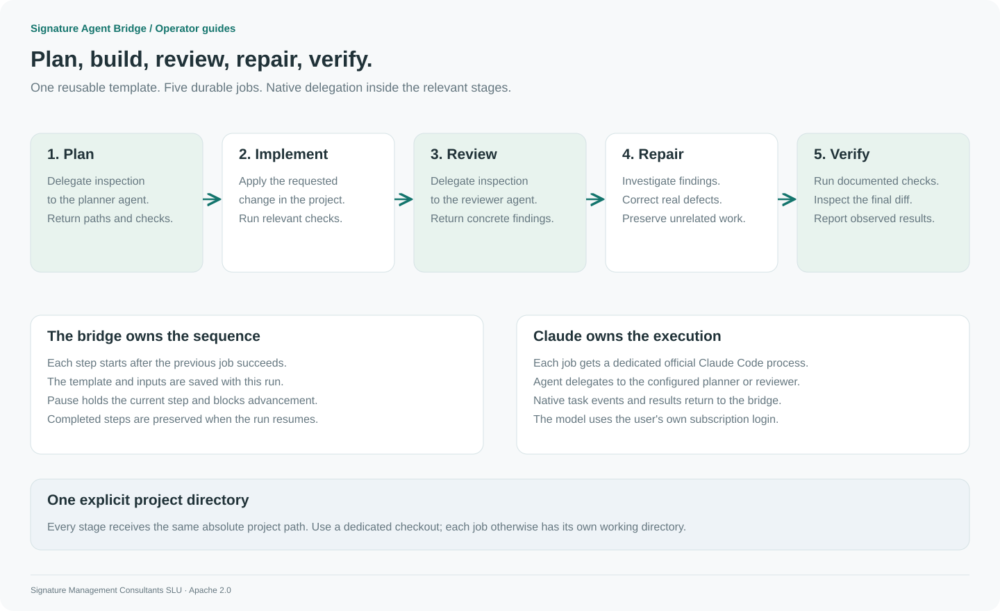

# Advanced Claude Code workflows

[Tokens](tokens.md) · [Template reference](workflows.md) · [Subagents](subagents.md)

This guide implements a repeatable **plan → implement → review → repair → verify** process. Each stage is a durable bridge job. Claude Code performs the model and tool work, including native delegation; the bridge controls ordering, state, pause/resume, and event delivery.



[PNG version](../assets/diagrams/advanced-workflow.png)

## 1. Configure the execution profile

Stop the bridge, then merge [workflow-profiles.json](../examples/workflow-profiles.json) into the `profiles` object of your existing `config.json`. Keep its required `default` profile and existing data/workspace/Claude paths.

The example adds `code-workflow`, a 15-minute attempt limit, up to four reported child tasks per attempt, and named `planner` and `reviewer` agents. The parent can edit files and run tests; these two specialists receive Read, Glob, and Grep.

Restart the bridge and reload the host integration. Confirm `bridge_status` lists `code-workflow`. A calling application's token must allow that profile and include the `workflows` scope.

## 2. Register the template

The complete definition is [advanced-development.json](../examples/workflow-templates/advanced-development.json). It includes all five stages and uses previous-step results as context.

From a clone of this repository, with the owner token loaded as described in [Tokens](tokens.md):

```sh
curl --fail-with-body -X PUT "$BRIDGE_URL/v1/bridge/admin/templates/advanced-development" \
  -H "Authorization: Bearer $BRIDGE_OWNER_TOKEN" \
  -H "Content-Type: application/json" \
  --data-binary @examples/workflow-templates/advanced-development.json
```

Alternatively, ask Claude to read that definition and call `bridge_template_save`, or create the same steps in **Workflows → New template**.

| Stage     | Work                                                            |
| --------- | --------------------------------------------------------------- |
| Plan      | Delegate project inspection to the native `planner` subagent    |
| Implement | Make the requested change and run relevant checks               |
| Review    | Delegate an independent inspection to `reviewer`                |
| Repair    | Investigate findings and correct substantiated defects          |
| Verify    | Run the project's documented checks and report observed results |

## 3. Launch from Claude

After enabling the profile and saving the template, ask Claude Desktop or Code:

```text
Use bridge_workflow_start with templateId advanced-development.
Set projectDir to /absolute/path/to/my-project and objective to:
Add a configurable timeout to the download command and test it.
Return the run ID and the management console URL.
```

The host calls the bridge's MCP tools. Worker jobs run in dedicated official Claude Code processes with native bypass. The host's initial integration consent and organization rules remain host-controlled.

## 4. Launch from the console or API

In **Workflows**, select `advanced-development`, then enter:

```json
{
  "projectDir": "/absolute/path/to/my-project",
  "objective": "Add a configurable timeout to the download command and test it."
}
```

Select **Start workflow**. Open each step to inspect its conversation, results, attempts, and reported child tasks.

An application uses its scoped `BRIDGE_TOKEN`:

```sh
curl --fail-with-body "$BRIDGE_URL/v1/bridge/workflow-runs" \
  -H "Authorization: Bearer $BRIDGE_TOKEN" \
  -H "Content-Type: application/json" \
  -H "Idempotency-Key: timeout-feature-001" \
  -d '{"templateId":"advanced-development","inputs":{"projectDir":"/absolute/path/to/my-project","objective":"Add a configurable timeout to the download command and test it."}}'
```

Use a new idempotency key for a new request. Observe the run through `GET /v1/bridge/workflow-runs/{id}`, its linked jobs, and `GET /v1/bridge/events`.

## 5. Control and recover the run

Pause the workflow to stop advancement and request a pause of its current attempt. Resume continues the current saved native session when available. Completed stages stay completed. Provider limits pause dispatch; an explicit provider reset can enable bounded automatic continuation.

A failed stage requires inspection before retry. Resume a paused workflow before retrying its step. Retry starts a fresh native session and may repeat effects. Cancellation does not undo files or external actions.

Each stage has a separate job directory and Claude session. The example therefore carries the same **absolute project directory** in every prompt. There is no automatic repository checkout or Git worktree. Use a dedicated checkout when concurrent work must be isolated. Do not run overlapping editing workflows against the same checkout.

A stage's successful Claude result is not proof that every assertion in its prose is correct. The verification prompt asks for observed command results; the operator still reviews the produced diff and evidence.

## Native host commands and boundaries

This bridge uses structured jobs, profiles, and template steps. It does not interpret interactive slash commands submitted as prompts. Its automatic worker disables host customizations and slash-command loading.

For host-native planning, reviews, or agent teams, use the commands supported by your installed Claude Code version in that host. Anthropic currently documents plan mode for planning and `/code-review ultra` (with `/ultrareview` as an alias) for cloud review. Those cloud workflows have their own availability and usage rules; the bridge does not schedule or resume them as local child jobs. See the [official command reference](https://code.claude.com/docs/en/commands).

The example here is an advanced local Claude Code workflow, not an integration with a separate product named UltraCode. It runs sequential stages; native subagents may do delegated work inside a stage. Arbitrary DAGs and independent agent-team orchestration are not part of this release.
