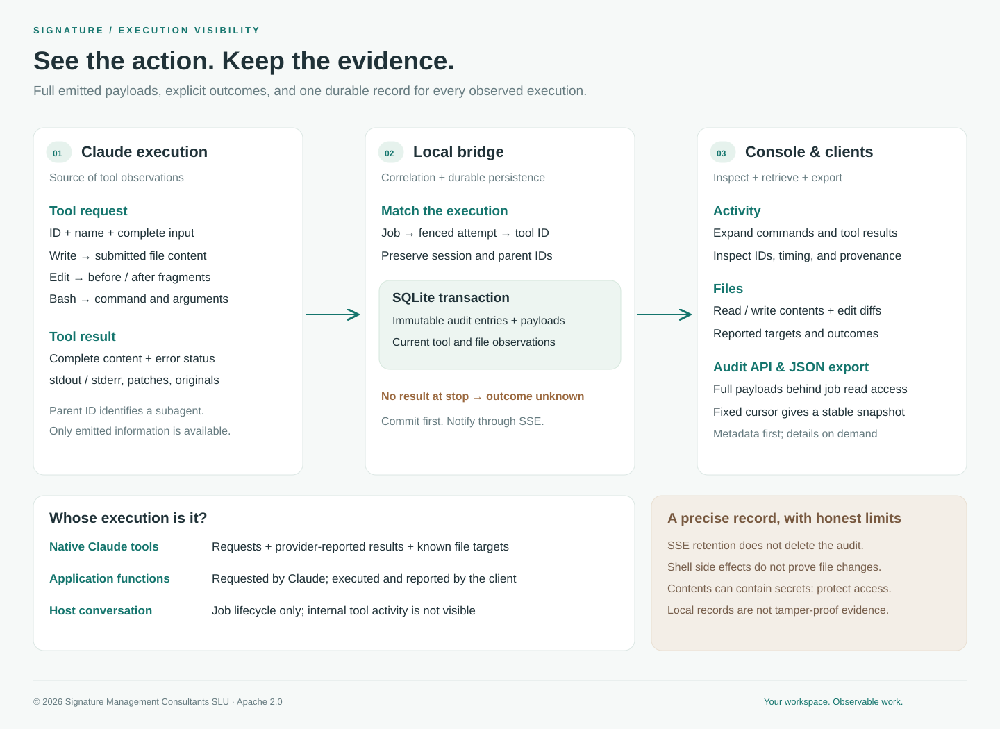
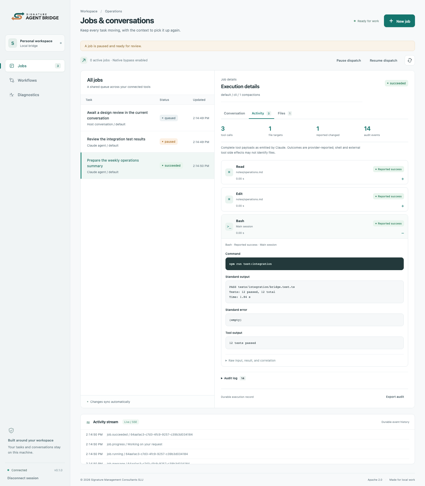
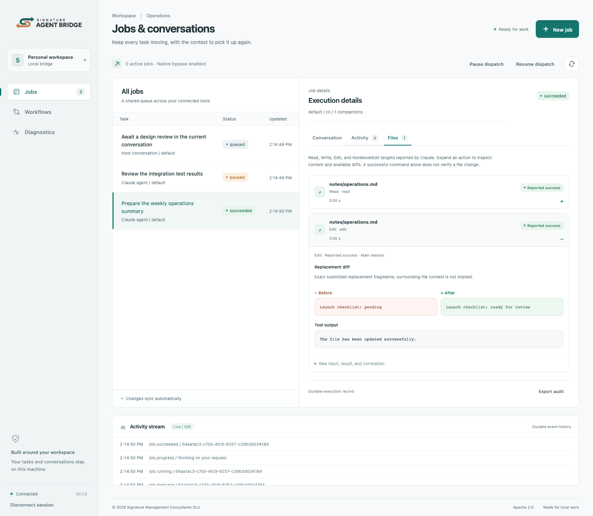

# Execution activity and audit

[README](../README.md) · [Console tour](dashboard.md) · [API](api.md) · [Operations](operations.md)

Every native job can expose its tool calls, file targets, commands, and complete emitted inputs/results. Select the job, then open **Activity** or **Files**. Workflow steps use the same views through **Open step**.



[PNG diagram](../assets/diagrams/execution-audit.png)

## Inspect what happened

**Activity** lists native tools in observation order. Expand a card to read its command, output, supplied content, and result. Bash cards show the command and stdout/stderr when Claude supplies those fields. **Raw input, result, and correlation** exposes the complete captured payload, native tool ID, bridge attempt ID, session ID, parent tool ID, timestamps, and observed duration.



**Files** lists individual Read, Write, Edit, and NotebookEdit actions with a reported target. Read exposes returned content; Write exposes submitted content. Edit displays the exact before/after replacement fragments. Structured patches and an original file are also displayed when Claude emits them. A fragment comparison is labeled **Replacement diff**: it is not presented as a complete repository diff. The same path can appear several times as a job reads and edits it.



The counters mean **distinct reported path strings**, native tool calls, distinct paths with a successful Write/Edit result, and persisted observations. Paths are kept as emitted, so relative and absolute spellings of one file can count separately. Times measure observation receipt at the bridge, not exact operating-system execution time. Out-of-order observations may have no duration.

| Outcome          | What the bridge observed                                                  |
| ---------------- | ------------------------------------------------------------------------- |
| Awaiting result  | A tool request arrived; no terminal result has arrived.                   |
| Reported success | Claude returned a tool result without an error flag.                      |
| Reported failure | Claude returned a tool result with `is_error: true`.                      |
| Outcome unknown  | The attempt ended or ownership was lost before a terminal result arrived. |

A failed or unknown action may already have produced effects. Pausing, cancellation, timeout, and crash recovery do not undo filesystem changes. Resume and retry retain earlier observations under their original attempts; replayed messages within an attempt do not create duplicate tool records. Subagent tool messages retain the reported parent tool ID without replacing the main job's resumable session.

## Execution ownership and coverage

- **Native agent jobs:** Claude's streamed tool requests/results are captured. Known built-in file tools provide target paths. Bash, network tools, and external commands have complete emitted payloads, but their indirect file effects are not inferred from command text.
- **OpenAI inference:** the application executes functions. Generated requests are recorded as `client.tool_requested`. Function requests and results supplied on a subsequent request are recorded as `client.tool_request_reported` and `client.tool_result_reported` in that new job. These are client reports, not bridge-verified execution. Use the stable tool-call ID to correlate turns.
- **Host conversation jobs:** the host reports progress and completion through MCP. The bridge cannot observe that conversation's internal tools or filesystem effects.

Only information emitted to the owned CLI process is available. Claude may shorten large tool outputs, omit subprocess internals, or report only part of a file. The bridge preserves the input/result payloads it receives without an additional audit preview truncation. The profile's `maxOutputBytes` still bounds the entire native stdout stream; exceeding it fails the attempt and leaves unfinished tools unknown. The audit does not scan arbitrary files, read private host transcripts, or infer missing content.

## Durable history and access

SQLite retains an append-only observation history and a current tool projection, written in the same transaction as queue state. The audit includes job lifecycle, session, compaction, rate-limit, and child-task observations. Tool payloads are committed before a metadata-only `job.tool` SSE notification is published. Other existing progress events can contain assistant text.

SSE retains approximately 10,000 recent events; pruning that notification window does **not** delete the audit. Tool observations and payloads remain until the local database is deliberately archived or removed. There is no automatic audit cleanup or retroactive reconstruction of information the bridge did not observe. Monitor disk usage and follow the [backup procedure](operations.md#data-retention-and-backups).

Complete payloads may include source code, credentials printed by a command, and private file contents. The audit deliberately preserves them. The same job ownership and `read` scope protect metadata, payloads, and exports; an owner can read all jobs. No token appears in a download URL. List responses and tool SSE notifications omit raw payloads; expanded inspectors load them through authenticated requests. Treat exports and backups with the same care as the workspace.

This is a local operational audit, not a tamper-proof compliance ledger: the operating-system user can edit the database. A successful tool result is not independent proof of the current filesystem state.

## Export or integrate

**Export audit** downloads a JSON snapshot with `schemaVersion`, `jobId`, `exportedAt`, `through`, and `entries`. It includes complete captured tool inputs/results. An export fixes `through` to the first page's highest audit ID so new observations cannot change that snapshot. The browser permits up to 64 MB and fails visibly rather than downloading a partial export.

For larger audits, use the streaming-to-disk [Node.js export example](../examples/export-audit.mjs):

```sh
export BRIDGE_URL="http://127.0.0.1:8766"
# Set BRIDGE_TOKEN using the token guide; never put it in a URL.
export JOB_ID="your-job-uuid"
node examples/export-audit.mjs ./execution-audit.json
```

The example creates a new private file, pages until completion, retries rate-limited reads, and removes its own incomplete output on failure. It never overwrites an existing export. See [getting a bridge token](tokens.md).

| Endpoint                                | Response                                                                                       |
| --------------------------------------- | ---------------------------------------------------------------------------------------------- |
| `GET /v1/bridge/jobs/{id}/audit`        | Immutable observation entries, current summary, `through`, and `nextCursor`.                   |
| `GET /v1/bridge/jobs/{id}/tools`        | Native tool metadata and `nextCursor`; no raw inputs/results.                                  |
| `GET /v1/bridge/jobs/{id}/tools/{tool}` | One complete tool observation, including input/output; `tool` is the numeric bridge record ID. |

Both lists accept `after` (numeric, default 0) and `limit` (1–200, default 100). Audit accepts `through` and `includePayloads=true`; tools accepts `filesOnly=true`. Audit pages also stop around 4 MB, always returning at least one whole record. Always follow `nextCursor` until it is `null`, even when a page has fewer entries than `limit`. `summary` describes current state and is not part of the immutable export snapshot. Tool projections are live; use audit entries for historical state.

```sh
curl --fail-with-body "$BRIDGE_URL/v1/bridge/jobs/$JOB_ID/audit?limit=100&includePayloads=true" \
  -H "Authorization: Bearer $BRIDGE_TOKEN"
```

[Mobile tool inspector](../assets/screenshots/activity-mobile.png) · [Mobile file diff](../assets/screenshots/files-mobile.png)

The protocol interpretation follows Anthropic's [programmatic CLI](https://code.claude.com/docs/en/headless) and [subagent message correlation](https://code.claude.com/docs/en/agent-sdk/subagents#detect-subagent-invocation) documentation.
