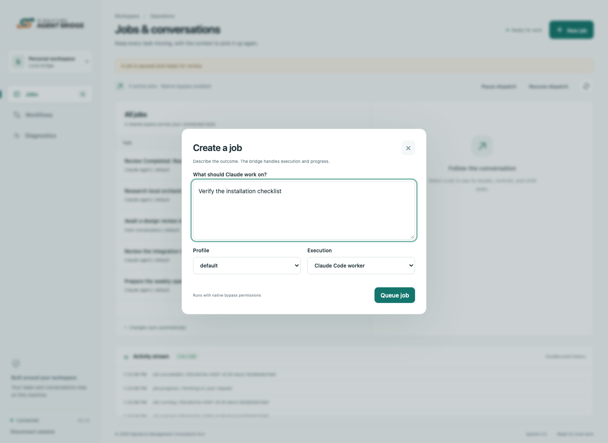
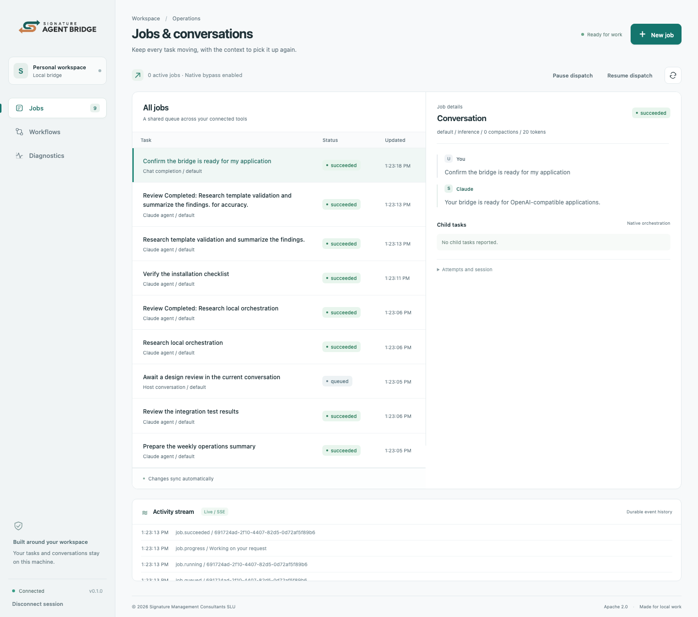
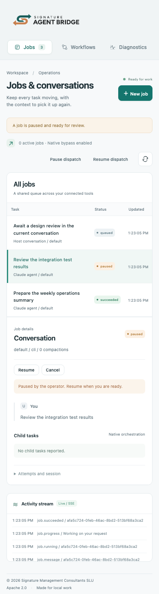
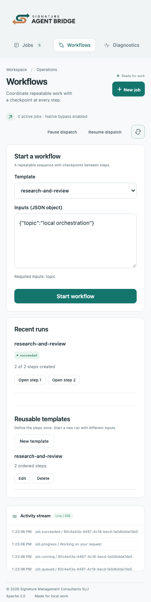

# Management console tour

[README](../README.md) · [Install](installation.md) · [Operations](operations.md)

The console is served by the local bridge. Open the URL returned by `bridge_panel` and authenticate with a bridge token. It submits through `/v1/chat/completions` and uses the same `/v1/bridge` management and notification extensions as other applications.

The screenshots below come from the running application with deterministic fixtures. They illustrate UI behavior without claiming the sample tasks were real production work.

## Jobs and conversations

Select a row to inspect messages, attempts, session continuity, and reported child tasks. Follow-ups remain associated with the same job. A message submitted while work is running is queued until the current attempt completes.

**New job** opens a focused dialog. Choose a configured profile and an automatic Claude Code worker, a Chat Completion, or the current host conversation.

Pause, resume, cancel, and retry are shown according to the job's state. Retry is explicitly different from resume: it starts a new session and can repeat prior effects.

## Chat Completions

SDK requests and console-created completions appear in the same queue. Select one to inspect its submitted message history, validated answer or client function requests, observed token usage, and execution attempts. The inference view hides native follow-up controls because the calling application supplies complete history for its next model turn.

[Mobile completion view](../assets/screenshots/completion-mobile.png)

## Workflows

Choose a configured template, provide its required inputs as a JSON object, and start a run. Each run shows its current state and links to the jobs created for its steps. **Open step** switches directly to that job's conversation.

A workflow pause blocks the next step and requests a pause of its current job. Resuming the workflow clears that barrier. A failed step can be retried from its job view after reviewing its effects.

## Reusable template editor

Use **New template** to define inputs, ordered steps, instructions, and execution profiles. **Edit** updates future runs; existing runs keep their original definition. The form checks references before saving. See [template authoring](workflows.md) for valid use cases and rules.

[Mobile template editor](../assets/screenshots/template-editor-mobile.png)

## Diagnostics and application access

Service health explains login readiness, dispatch state, active jobs, connected hosts, profiles, OpenAI base URL, model aliases, and the workspace. Expand **Technical details** for the full status payload.

Create a separate token for each trusted application. New tokens are displayed once in the panel; revocation immediately invalidates requests and active event streams.

## Responsive navigation

The sidebar becomes a compact navigation row on narrow screens. Queue and conversation panels stack, controls remain accessible, and long diagnostics wrap rather than widening the page. The copyright footer stays at the bottom of the viewport; content reserves space so controls remain reachable.

| Mobile jobs                                                | Mobile workflows                                                |
| ---------------------------------------------------------- | --------------------------------------------------------------- |
|  |  |

[Tablet jobs](../assets/screenshots/jobs-tablet.png) · [Tablet workflows](../assets/screenshots/workflows-tablet.png) · [Mobile diagnostics](../assets/screenshots/diagnostics-mobile.png)

## Live activity

The activity stream receives authenticated SSE events and reconnects with the last event ID. When retention has removed older events, it refreshes current job state before reconnecting. Tokens stay in tab memory and are never placed in a URL or browser local storage.
