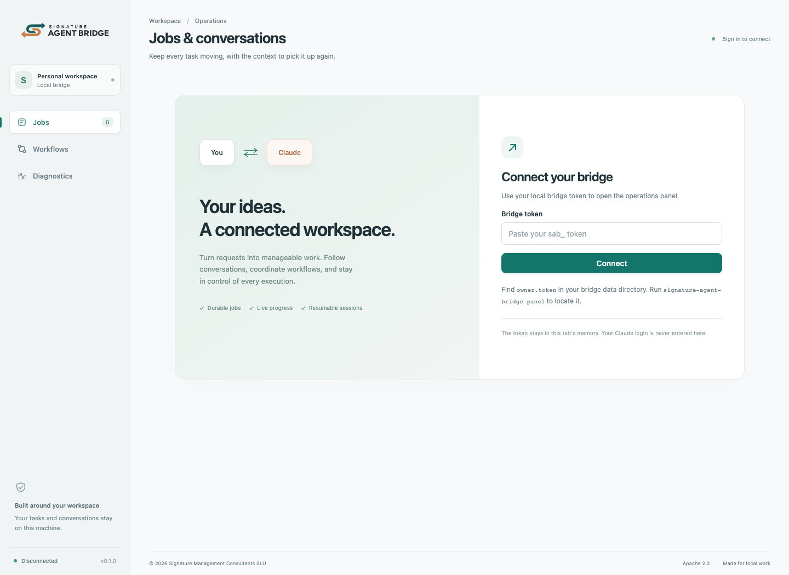

# Install Signature Agent Bridge

[Back to README](../README.md) · [Console tour](dashboard.md)

## Requirements

- Your own supported Claude subscription and the official Claude Code executable, version 2.1.260 or later.
- A successful `claude auth login` and `claude auth status` showing `claude.ai`.
- A supported release platform. Desktop packages target macOS and Windows. The Code plugin also supports Linux.
- Permission to install a local extension or plugin under your organization's policy.
- Git Bash on Windows for the Code plugin bootstrap. Desktop's binary extension does not require Bash for startup.

Release packages include their Node.js runtime. There is no separate daemon installation and no API key to enter. Do not export `ANTHROPIC_API_KEY`, `ANTHROPIC_AUTH_TOKEN`, `CLAUDE_CODE_OAUTH_TOKEN`, a custom `ANTHROPIC_BASE_URL`, or a third-party provider flag in the bridge's environment.

## Claude Code

Inside Claude Code:

```text
/plugin marketplace add signature-organization/signature-agent-bridge
/plugin install signature-agent-bridge@signature-organization
```

Or use the equivalent terminal commands:

```sh
claude plugin marketplace add signature-organization/signature-agent-bridge
claude plugin install signature-agent-bridge@signature-organization
```

Restart the host. The MCP server launches the pinned bootstrap, which downloads a platform archive and its published checksum, verifies it, extracts it to the user's cache, and starts the adapter. Checksums protect download integrity; release ownership and GitHub HTTPS remain part of the trust boundary.

Run `/signature-agent-bridge:bridge` or ask Claude to use `bridge_status`. The result should show protocol version 1, execution `local-claude-code`, and permission mode `bypassPermissions`. Readiness may briefly show a login check while the local preflight finishes.

A working installation exposes tools including `bridge_submit`, `bridge_job`, `bridge_message`, `bridge_control`, `bridge_workflow_start`, and `bridge_panel`.

## Claude Desktop

1. Open the [release page](https://github.com/signature-organization/signature-agent-bridge/releases/latest).
2. Download your platform's `signature-agent-bridge-<version>-<platform>-<architecture>.mcpb`.
3. In Desktop, open **Settings → Extensions → Advanced settings → Install Extension…**.
4. Select the bundle, complete the host's consent, and enable it.
5. Start a conversation and ask Claude to inspect `bridge_status`.

Each Desktop bundle includes a binary server, the embedded management console, and license notices. The installed official Claude Code executable supplies the model session. Desktop itself does not expose a general-purpose headless chat execution API.

On a managed account, an extension allowlist may require an administrator to publish or approve the bundle. Follow the host's policy. The bridge does not modify it.

These installation surfaces follow [Anthropic's Desktop extension guide](https://support.claude.com/en/articles/10949351-getting-started-with-local-mcp-servers-on-claude-desktop) and [Code plugin documentation](https://code.claude.com/docs/en/discover-plugins).

## First job and dashboard

Ask:

> Use bridge_submit to create a job that writes hello.txt with a short greeting. Inspect bridge_job until it finishes, then use bridge_panel to show the dashboard address.

Open the returned address, normally `http://127.0.0.1:8766`. Read `owner.token` from your local data directory and paste it into the connection screen. Do not paste this token into a Claude conversation.

The token file appears when the listener first starts successfully. Follow [Get your bridge token](tokens.md) for exact clipboard commands, creating a scoped application token, and authenticating REST/SSE requests.



| OS      | Data directory                                             |
| ------- | ---------------------------------------------------------- |
| macOS   | `~/Library/Application Support/Signature Agent Bridge`     |
| Windows | `%LOCALAPPDATA%\Signature Agent Bridge`                    |
| Linux   | `${XDG_STATE_HOME:-~/.local/state}/Signature Agent Bridge` |

If you use a portable executable, `signature-agent-bridge panel` opens the browser and prints the token-file location. A plugin-managed executable is kept in its cache and is not added to your shell's PATH.

## Portable CLI

Download the matching `.tar.gz` release archive, verify it against `SHA256SUMS`, and extract it to a directory you control. On macOS/Linux, run `./signature-agent-bridge`; on Windows, run `.\signature-agent-bridge.exe`.

Keep the extracted folder together. Intel Mac packages include a launcher and a sibling `runtime/` directory; moving only the launcher breaks startup. Other platforms use a single executable. Neither layout requires a separate Node.js installation.

```sh
./signature-agent-bridge init
./signature-agent-bridge serve
```

In another terminal:

```sh
./signature-agent-bridge status
./signature-agent-bridge panel
./signature-agent-bridge token --id my-app --profiles default --scopes read,submit,control
```

Pass `--data-dir /absolute/path` to every command for a separate local instance. The API always binds to loopback; use a tunnel for remote access.

## Optional Code channel notifications

Normal automatic jobs do not require channel enrollment.

For jobs explicitly assigned to the current Code conversation, launch the adapter with `mcp --channel` and enroll it using the host's current channel mechanism. The simplest explicit setup uses a portable executable:

```sh
claude mcp add --transport stdio signature-agent-bridge-channel -- /absolute/path/signature-agent-bridge mcp --channel
claude --dangerously-load-development-channels server:signature-agent-bridge-channel
```

Development channels are subject to [Anthropic's channel requirements](https://code.claude.com/docs/en/channels-reference), host consent, and organization policy. A channel notification only advertises pending work. The host must claim it, send progress, and explicitly complete or acknowledge a stop.

## Updates and removal

In Code:

```text
/plugin marketplace update signature-organization
/plugin update signature-agent-bridge@signature-organization
```

Restart Code after an update. In Desktop, install the newer matching `.mcpb` through the extension settings. Stop the old service before switching release versions if its protocol is incompatible.

Configuration, jobs, sessions, and tokens live outside the plugin cache. Reinstalling or removing a plugin does not erase this data. Removing both host integrations stops future host-managed launches. Use the portable CLI's `stop` command to stop a running listener; archive or delete the data directory only when you intentionally want to remove its history.

## Troubleshooting

| Symptom                             | Check                                                                                                                      |
| ----------------------------------- | -------------------------------------------------------------------------------------------------------------------------- |
| Tools do not appear                 | Enable the plugin/extension, restart the host, and inspect its MCP startup log                                             |
| Authentication required             | Run `claude auth status` as the same OS user; verify the configured absolute executable path                               |
| Subscription configuration rejected | Remove API/provider overrides from the service environment and restart                                                     |
| Listener does not start             | Inspect `service.log`; another program may own port 8766                                                                   |
| macOS blocks an executable          | Use the host/OS's normal approval flow for software you trust; release binaries use ad-hoc signing, not Apple notarization |
| Windows cannot find Bash            | Use Git Bash on PATH for the Code plugin, or install the Desktop binary bundle                                             |
| Dashboard says unauthorized         | Use the local bridge token, not Claude credentials; revoked tokens stop working immediately                                |
| Job stays paused                    | Inspect its reason and provider reset time; resume the workflow as well if it was explicitly paused                        |
| Host channel job is interrupted     | Reconcile any external actions before retrying; the previous host's claim has expired                                      |
