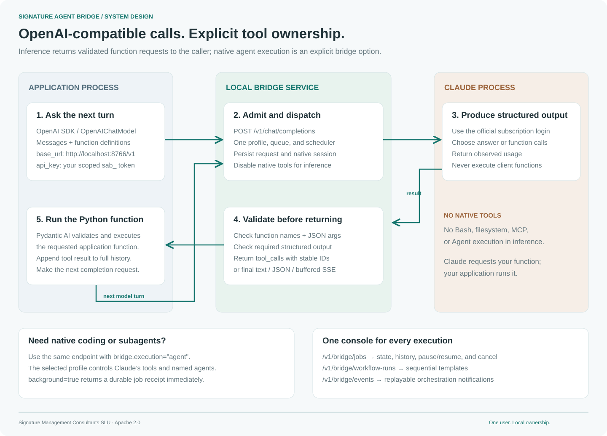

# OpenAI-compatible applications

[Quickstart](installation.md) · [Get a token](tokens.md) · [API reference](api.md) · [Architecture](architecture.md)

Use the OpenAI Python SDK or Pydantic AI against your own local Claude subscription. The bridge implements **Chat Completions**, model discovery, function-call exchanges, and structured output. One authenticated API and one durable queue also serve the console, Claude integrations, and workflow engine.



[PNG diagram](../assets/diagrams/openai-compatible.png)

## Connect in four steps

1. [Install the Desktop extension or Code plugin](installation.md), sign in through official Claude Code, and start the host.
2. [Copy the local owner token](tokens.md#2-get-the-owner-token-for-the-console), open the console, and create an application token under **Diagnostics → Client access**. Chat requests require `read` and `submit`; allow the `default` profile.
3. Put that application's `sab_` token in `BRIDGE_TOKEN`. Set `BRIDGE_URL` to `http://127.0.0.1:8766`, or your configured HTTPS tunnel origin.
4. Set the SDK base URL to **`$BRIDGE_URL/v1`**, the SDK `api_key` to **`BRIDGE_TOKEN`**, and the model to **`bridge/default`**.

The SDK's `api_key` parameter is the bridge bearer token. You do not need an OpenAI key, a Claude API key, or access to Claude's stored login credentials. The SDK connects only to your configured bridge URL.

```sh
python3 -m venv .venv
. .venv/bin/activate
python -m pip install 'openai==3.19.2' 'pydantic-ai-slim[openai]==2.49.0'
export BRIDGE_URL=http://127.0.0.1:8766
# Supply BRIDGE_TOKEN through your private environment configuration.
python examples/pydantic_agent.py
```

On PowerShell, activate with `.venv\Scripts\Activate.ps1` and set `$env:BRIDGE_URL = 'http://127.0.0.1:8766'`.

## OpenAI Python SDK

```python
import os
from openai import OpenAI

with OpenAI(
    base_url=os.environ["BRIDGE_URL"].rstrip("/") + "/v1",
    api_key=os.environ["BRIDGE_TOKEN"],
    max_retries=0,
    timeout=330.0,
) as client:
    print([model.id for model in client.models.list().data])
    response = client.chat.completions.create(
        model="bridge/default",
        messages=[{"role": "user", "content": "Explain a durable queue in one sentence."}],
    )
    print(response.choices[0].message.content)
```

`GET /v1/models` lists only configured profiles available to that token. `bridge/default` selects the default bridge profile, not a model hosted by OpenAI. The profile may pin an official Claude model; otherwise Claude uses its native default.

## Pydantic AI with local Python functions

Use **`OpenAIChatModel` explicitly**. Pydantic AI also supports a Responses model; `/v1/responses` is outside this bridge's contract.

```python
import asyncio
import os
from openai import AsyncOpenAI
from pydantic_ai import Agent
from pydantic_ai.models.openai import OpenAIChatModel
from pydantic_ai.providers.openai import OpenAIProvider

async def main():
    async with AsyncOpenAI(
        base_url=os.environ["BRIDGE_URL"].rstrip("/") + "/v1",
        api_key=os.environ["BRIDGE_TOKEN"],
        max_retries=0,
        timeout=330.0,
    ) as client:
        model = OpenAIChatModel("bridge/default", provider=OpenAIProvider(openai_client=client))
        agent = Agent(model)

        @agent.tool_plain
        def add(a: int, b: int) -> int:
            """Add two integers in the calling Python application."""
            return a + b

        result = await agent.run("Use add with a=2 and b=5, then report the result.")
        print(result.output)

asyncio.run(main())
```

Claude requests `add` through a validated `tool_calls` result. **Pydantic AI executes the Python function in your application**, then submits the full history with its tool result. Each model turn is a separate durable inference job. Function names, JSON arguments, declared schemas, and tool-result IDs are validated. The bridge never runs client function code.

For typed output, pass a Pydantic class as `Agent(model, output_type=YourModel)`. Pydantic AI's default output-function strategy is supported. `output_type=NativeOutput(YourModel)` uses `response_format.json_schema`. See the [runnable example](../examples/pydantic_agent.py) and [SDK compatibility tests](../tests/clients/openai_clients.py).

## Two execution choices, one admission endpoint

| Choice            | Request                                                                      | Who runs tools?                                                                                       | Result                        |
| ----------------- | ---------------------------------------------------------------------------- | ----------------------------------------------------------------------------------------------------- | ----------------------------- |
| Inference         | Standard Chat Completions request; default `bridge.execution` is `inference` | Your application runs declared functions. Native Bash, filesystem, MCP, and Agent tools are disabled. | OpenAI completion JSON or SSE |
| Native agent      | `bridge: {"execution":"agent","background":true}`                            | Claude Code runs the selected profile's tools and native subagents with bypass enabled.               | HTTP 202 durable job receipt  |
| Host conversation | `bridge: {"execution":"channel","background":true}`                          | A Desktop/Code conversation explicitly claims work through MCP.                                       | HTTP 202 durable job receipt  |

`background:true` also works with inference. It returns immediately and preserves the queued job independently of the submitting connection. Read the result and control execution through `/v1/bridge/jobs/{id}` and the console. Native agent requests may use `background:false` to wait for completion JSON or SSE. Channel requests require background execution.

Native agent/channel requests accept one text user message and no client function tools or structured-output request. Their continued conversation uses the bridge's native follow-up controls. Inference requests instead send the full message history to `/v1/chat/completions` for each next turn.

To launch native subagents through the same API:

```sh
curl --fail-with-body "$BRIDGE_URL/v1/chat/completions" \
  -H "Authorization: Bearer $BRIDGE_TOKEN" \
  -H "Content-Type: application/json" \
  -H "Idempotency-Key: project-review-001" \
  -d '{"model":"bridge/code-workflow","messages":[{"role":"user","content":"Use Agent to ask reviewer to inspect /absolute/path/to/project. Return concrete findings."}],"bridge":{"execution":"agent","background":true}}'
```

Configure `code-workflow` first using [the advanced workflow guide](advanced-workflows.md). OpenAI SDK callers pass this extension with `extra_body={"bridge": {"execution": "agent", "background": True}}`; a background result has the bridge Job schema, so use raw HTTP when you need a typed job receipt. Workflows use `/v1/bridge/workflow-runs` and the same queue, profiles, and execution controls.

## Streaming behavior

Set `stream=True` in the OpenAI SDK, or use Pydantic AI's `run_stream`. The bridge sends SSE keepalive comments while Claude runs, then sends the **fully validated final output** as standard completion chunks followed by `data: [DONE]`. Function deltas include stable IDs, names, and JSON arguments. `stream_options={"include_usage": True}` adds a final usage chunk when Claude reports counts.

This is buffered streaming: it keeps the connection active but does not expose token-by-token generation. A structured response must pass validation before any answer is released. The console's `/v1/bridge/events` stream carries durable job progress, compaction, workflow, and quota notifications; it is an orchestration extension of the same API, with its own event format and replay cursor.

## Supported contract

| Field or capability                      | Support                                                                                                                                                 |
| ---------------------------------------- | ------------------------------------------------------------------------------------------------------------------------------------------------------- |
| `messages`                               | 1–128 messages; system, developer, user, assistant, tool; strings or text-only content parts                                                            |
| `tools`                                  | Up to 32 function definitions; up to 16 returned calls; validated JSON arguments                                                                        |
| `tool_choice`                            | `auto`, `none`, `required`, or a named function                                                                                                         |
| `parallel_tool_calls`                    | Boolean; false rejects a response containing multiple calls                                                                                             |
| `response_format`                        | `text`, `json_object`, `json_schema`                                                                                                                    |
| JSON Schema                              | Bounded schemas, including local `$ref`/`$defs`; external references, regex patterns, format annotations, and dynamic/recursive references are rejected |
| `n`                                      | Exactly 1                                                                                                                                               |
| `stream`, `stream_options.include_usage` | Buffered OpenAI SSE and optional observed usage                                                                                                         |
| `bridge`                                 | `execution` and `background` as described above                                                                                                         |
| Sampling and generation parameters       | `temperature`, `top_p`, `max_tokens`, `max_completion_tokens`, `stop`, penalties, seed, and logprobs return HTTP 400                                    |
| Other APIs and media                     | Responses, embeddings, audio, images, video, files, batches, and multimodal content are unsupported                                                     |

The request object is strict: unsupported fields return an error rather than silently changing behavior. The expanded conversation is limited to 100,000 characters and the HTTP body to 120,000 bytes. Profiles bound attempt duration, output size, and model turns. Schema validation is enforced even when `strict` is false.

Usage reflects Claude's reported invocation totals, including cache reads/writes and bridge instructions. It is not an OpenAI billing record or an exact tokenization of the submitted messages. Missing provider usage is omitted.

## Timeouts, retries, and quota recovery

- The default completion deadline is **300 seconds including queue wait**. Set the SDK timeout slightly higher, or configure `openai.timeoutMs`. The default service-wide waiting-connection limit is 16; each principal can hold four.
- Set SDK `max_retries=0` unless you implement deliberate recovery. New model requests can consume subscription allowance; a repeated external function may also have side effects.
- Reuse one **`Idempotency-Key` per logical request and exact body** across uncertain retries. Existing jobs and completion IDs are reused; a different body returns 409. Generate a fresh key for each next conversation turn. Multiple connections to the same key do not cancel each other's work.
- `X-Bridge-Job-Id` links an admitted request to the panel. Errors after admission also include `error.job_id`. A quota pause returns 429 and `Retry-After` when the provider supplies a reset. An operator pause returns 503. Those jobs remain durable for recovery.
- After SSE headers have been sent, a failure arrives as `data: {"error":...}` followed by `[DONE]`; inspect the exception from your SDK and the durable job. HTTP status cannot change midstream.
- Synchronous disconnects, revoked tokens, and deadlines cancel work when its last waiter leaves. Background jobs survive a disconnected submitter. Service shutdown records unfinished execution for inspection. Cancellation cannot roll back application functions or native tool effects.
- Resume a paused job through the console or `/v1/bridge/jobs/{id}/resume` after checking the [recovery guide](operations.md). Reattach by sending the same body and idempotency key. Do not create a new job simply because a paused request ended.

Native Claude owns compaction and resumable sessions. For a new inference turn, the application owns the complete OpenAI message history; for recovery of that same interrupted turn, the bridge uses its saved native session.

## Sources and verification

The contract follows [OpenAI Chat Completions](https://developers.openai.com/api/reference/resources/chat/subresources/completions/methods/create), [Pydantic AI's OpenAI provider](https://pydantic.dev/docs/ai/models/openai/), and [Claude Code's programmatic interface](https://code.claude.com/docs/en/headless). The [verification record](verification.md) distinguishes deterministic client tests, real Claude execution, native package checks, and host-specific installation limits.
