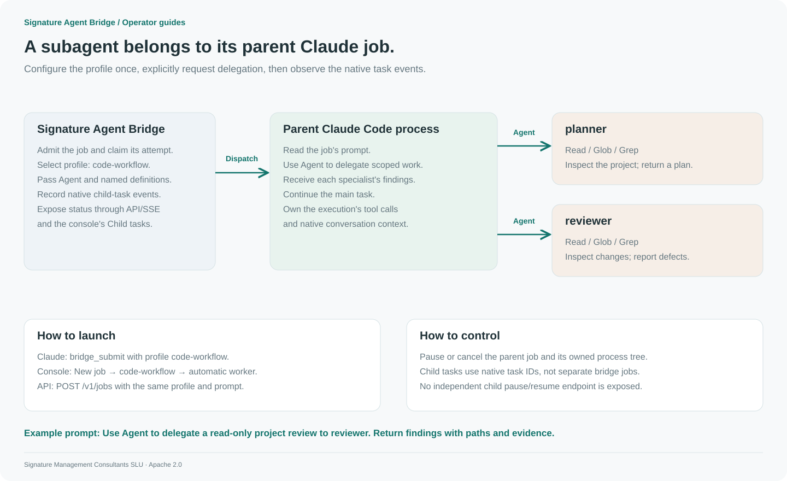

# Launch and observe native subagents

[Advanced workflow](advanced-workflows.md) · [Profiles](configuration.md) · [Tokens](tokens.md)

A bridge job owns one parent Claude Code process. When the selected profile includes `Agent`, that parent can delegate to named native Claude Code subagents. The parent receives their results; the bridge records reported task events and exposes them to the console and SSE clients.



[PNG version](../assets/diagrams/subagents.png)

## Configure once

Follow the profile setup in [Advanced workflows](advanced-workflows.md). The included [profile example](../examples/workflow-profiles.json) defines:

- `planner`: inspect the project and propose a focused implementation plan.
- `reviewer`: inspect existing changes and report concrete defects.
- `Agent` in the parent's allowed tools, with a reported child-task cap of four per attempt.

Bridge profiles explicitly pass these definitions through Claude Code's native `--agents` mechanism. A worker does not automatically inherit a host's personal plugins, project agents, or skills. See [Anthropic's subagent documentation](https://code.claude.com/docs/en/sub-agents) for the underlying model.

## Launch from Claude Desktop or Code

Ask the host:

```text
Call bridge_submit with profile code-workflow and mode cli.
Prompt: Use Agent to delegate a read-only review of /absolute/path/to/project
to the reviewer subagent. Summarize its findings with file paths and evidence.
Return the job ID so I can follow it in the bridge console.
```

This explicitly asks the dedicated worker to delegate. It does not ask the current host conversation to perform the review itself.

## Launch from the console

Choose **New job → Execution profile: code-workflow → Automatic Claude Code worker**. Enter the same prompt and queue it. Select the job and inspect **Child tasks** and the activity stream.

## Launch from an application

```sh
curl --fail-with-body "$BRIDGE_URL/v1/jobs" \
  -H "Authorization: Bearer $BRIDGE_TOKEN" \
  -H "Content-Type: application/json" \
  -d '{"profile":"code-workflow","mode":"cli","prompt":"Use Agent to delegate a read-only review of /absolute/path/to/project to the reviewer subagent. Return findings with file paths and evidence."}'
```

The client token must include `submit` and allow `code-workflow`. Add `read` to inspect results/events and `control` for execution controls.

## Observe and control

`job.subagent` events contain the native task ID and reported status. The current job's `subagents` map is visible through `bridge_job`, the job API, and the console. Progress depends on the events emitted by the installed Claude Code version.

Pause or cancel the **parent job** to stop its owned process tree. Children do not have separate bridge job IDs or individual pause endpoints. The child cap applies to reported tasks in one attempt, not to a persistent shared pool of agents. Profiles prevent Agent in the configured child's own tool list.

If no child task appears, confirm the selected profile includes Agent and the named definition, inspect the job's error/result, and verify that Claude actually delegated. The bridge does not invent a completed child task merely because the prompt requested one.
