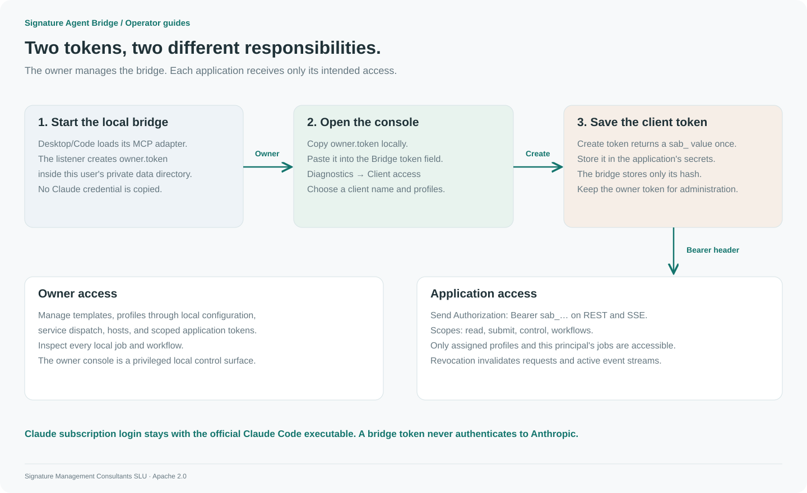

# Get and use your bridge token

[Quickstart](installation.md) · [API](api.md) · [Advanced workflows](advanced-workflows.md)

A **bridge token** authenticates to your local Signature Agent Bridge. It starts with `sab_`. It is separate from your Claude subscription login. Claude Code manages that login; you never need to obtain a Claude OAuth token or API key for this project.



[PNG version](../assets/diagrams/tokens.png)

## 1. Start the bridge first

Install and enable the Code plugin or Desktop extension, then restart the host. Its MCP adapter starts the local listener. Ask Claude to call `bridge_status` and `bridge_panel`.

The listener creates `owner.token` on its first successful start. The `init` command only creates configuration; it does not start the service or create this token.

With the portable download, run `./signature-agent-bridge serve` (Windows: `.\signature-agent-bridge.exe serve`) and keep that terminal open. The default console address is `http://127.0.0.1:8766`; `bridge_panel` returns the actual address if the configured port differs.

## 2. Get the owner token for the console

The owner token grants full local administration. Copy it from the private file on your own computer and paste it into the console's **Bridge token** field.

| Platform        | File                                                                   |
| --------------- | ---------------------------------------------------------------------- |
| macOS           | `~/Library/Application Support/Signature Agent Bridge/owner.token`     |
| Windows         | `%LOCALAPPDATA%\Signature Agent Bridge\owner.token`                    |
| Linux           | `${XDG_STATE_HOME:-~/.local/state}/Signature Agent Bridge/owner.token` |
| Custom instance | `<the --data-dir you selected>/owner.token`                            |

On macOS, copy directly to the clipboard:

```sh
pbcopy < "$HOME/Library/Application Support/Signature Agent Bridge/owner.token"
```

On Windows PowerShell:

```powershell
Get-Content -Raw (Join-Path $env:LOCALAPPDATA 'Signature Agent Bridge\owner.token') | Set-Clipboard
```

On a Linux Wayland desktop with `wl-copy` installed:

```sh
wl-copy < "${XDG_STATE_HOME:-$HOME/.local/state}/Signature Agent Bridge/owner.token"
```

You can also open the file in a local text editor. Keep the token out of chat, screenshots, Git, and URLs. The console retains it only in tab memory; disconnecting or reloading requires authentication again.

## 3. Create a separate token for an application

1. Connect to the console with the owner token.
2. Open **Diagnostics → Client access**.
3. Enter a stable client name, such as `build-helper`.
4. Enter allowed profiles, such as `default` or `code-workflow`.
5. Click **Create token** and copy the displayed value into that application's private configuration.

The console creates a client with `read`, `submit`, `control`, and `workflows` scopes. For narrower scopes, use the CLI or API. Tokens are displayed once; the database retains a hash. Separate client names isolate job access. Tokens issued with the same client name represent the same principal.

The portable CLI can create the same token without copying the owner token into a shell:

```sh
./signature-agent-bridge token --id build-helper --profiles default --scopes read,submit,control,workflows
```

Its JSON output contains `token`. Store that value privately as `BRIDGE_TOKEN` in your application. The plugin's cached executable is not automatically added to PATH; use the downloaded portable executable for these commands.

## 4. Make an authenticated request

The examples below assume your process already has `BRIDGE_TOKEN` from its private environment configuration:

```sh
export BRIDGE_URL=http://127.0.0.1:8766
curl --fail-with-body "$BRIDGE_URL/v1/status" \
  -H "Authorization: Bearer $BRIDGE_TOKEN"
node examples/client.mjs "Summarize the purpose of the bridge"
```

Send the same header on REST and SSE requests. Never add `?token=...` to a URL. Owner-only operations require the owner token; normal applications should use their scoped client token.

To create a read-only client through the API, first load `BRIDGE_OWNER_TOKEN` from the owner file without printing it. On macOS:

```sh
IFS= read -r BRIDGE_OWNER_TOKEN < "$HOME/Library/Application Support/Signature Agent Bridge/owner.token"
export BRIDGE_OWNER_TOKEN
```

Use the corresponding path in the table for Linux. In PowerShell: `$env:BRIDGE_OWNER_TOKEN = (Get-Content -Raw (Join-Path $env:LOCALAPPDATA 'Signature Agent Bridge\owner.token')).Trim()`.

Then submit:

```sh
curl --fail-with-body "$BRIDGE_URL/v1/admin/tokens" \
  -H "Authorization: Bearer $BRIDGE_OWNER_TOKEN" \
  -H "Content-Type: application/json" \
  -d '{"id":"status-viewer","profiles":["default"],"scopes":["read"]}'
```

## 5. Revoke or replace access

Click **Revoke** next to the client in Diagnostics, or run:

```sh
./signature-agent-bridge revoke --id build-helper
```

Revocation invalidates all tokens for that client name and disconnects its SSE streams. Create a replacement token and update the application's private configuration. Revocation does not cancel jobs already admitted; cancel those explicitly if needed.

## Troubleshooting

| Symptom                                  | What to check                                                                                                             |
| ---------------------------------------- | ------------------------------------------------------------------------------------------------------------------------- |
| `owner.token` is missing                 | The listener must start successfully; check host extension status and `service.log`. Confirm the selected data directory. |
| Connection refused                       | Start the host integration or portable service. Use the URL from `bridge_panel`.                                          |
| HTTP 401                                 | Use a complete `sab_` token, trim whitespace, and check whether the client was revoked.                                   |
| HTTP 403                                 | The token may lack the requested scope/profile, or the request's Host/Origin is not allowed.                              |
| A client cannot see another client's job | Resource isolation is working. Use that client's token or the local owner console.                                        |
| A custom tunnel fails                    | Configure the explicit hostname and browser origin; keep bearer authentication. See [tunnels](tunnels.md).                |
