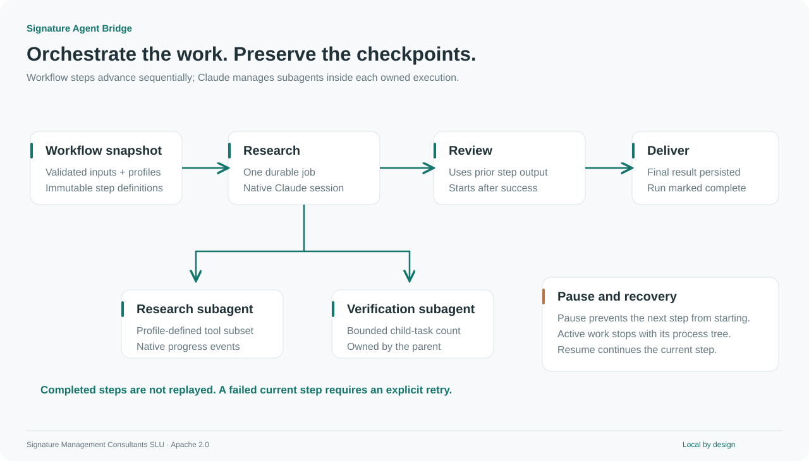
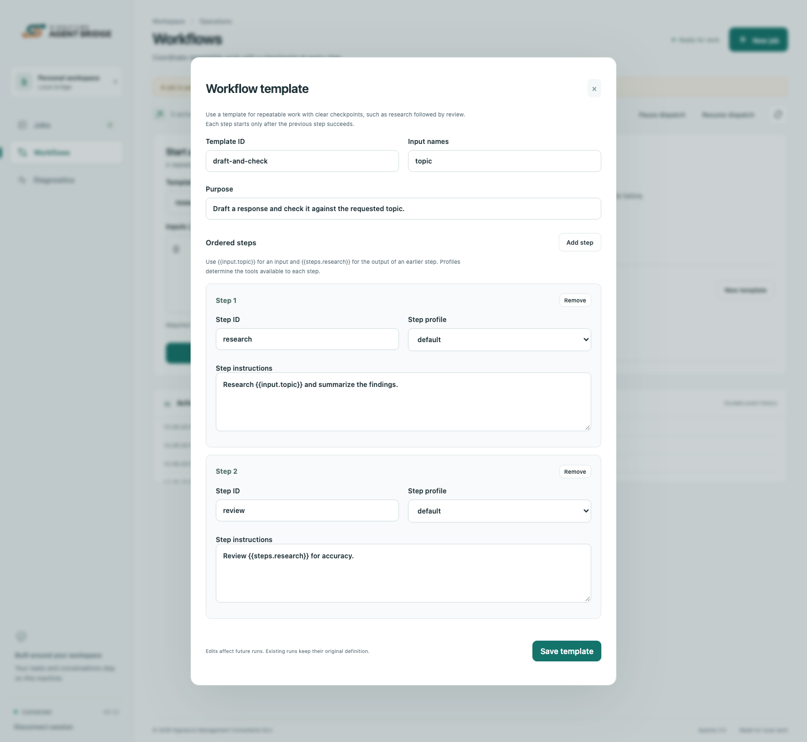

# Workflow templates and native subagents

[README](../README.md) · [Console tour](dashboard.md) · [API](api.md)

## What a template is for

A template is a reusable, ordered sequence of prompts. It names the inputs supplied for each run, the execution profile used by each step, and any earlier result that the next step needs.

Use a template when the same process repeats with different material: research then review, draft then critique, extract then summarize, or implement then verify. Use a standalone job for a one-off task or an open-ended conversation.

Templates provide **structure and checkpoints**. They do not make model output deterministic or guarantee that a tool's external side effect can be rolled back.



[PNG version](../assets/diagrams/workflows.png)

## Define a template in the console

1. Open **Workflows → New template**.
2. Enter a stable template ID, a short purpose, and comma-separated input names.
3. Add the steps in execution order. Give each a unique ID, a prompt, and an available profile.
4. Reference supplied inputs with `{{input.name}}` and a completed earlier step with `{{steps.step_id}}`.
5. Select **Save template**.

The editor validates the definition before saving. It persists to the bridge's `config.json` and becomes available immediately. Existing runs keep the template snapshot they started with.



[Mobile editor](../assets/screenshots/template-editor-mobile.png)

For example, create `research-review` with input `topic` and these steps:

| Step ID    | Instructions                                                                | Profile   |
| ---------- | --------------------------------------------------------------------------- | --------- |
| `research` | `Research {{input.topic}} and summarize the findings.`                      | `default` |
| `review`   | `Review these findings for gaps and unsupported claims: {{steps.research}}` | `default` |

Start a run with:

```json
{ "topic": "how to document a local integration" }
```

A profile must include the tools the work actually needs. The default profile does not include web search; enable a suitable profile locally when research requires current online sources.

## Define a template through Claude or the API

Ask Claude to use `bridge_templates` and `bridge_template_save`. The included skill explains the same workflow.

Owner-authenticated API clients can save an equivalent definition:

```sh
curl --fail-with-body -X PUT "$BRIDGE_URL/v1/admin/templates/research-review" \
  -H "Authorization: Bearer $BRIDGE_OWNER_TOKEN" \
  -H "Content-Type: application/json" \
  -d '{
    "id": "research-review",
    "description": "Research a topic, then check the findings.",
    "inputs": ["topic"],
    "steps": [
      {"id":"research","profile":"default","prompt":"Research {{input.topic}}."},
      {"id":"review","profile":"default","prompt":"Review {{steps.research}}."}
    ]
  }'
```

`GET /v1/admin/templates` lists full definitions. `DELETE /v1/admin/templates/{templateId}` removes a reusable definition while preserving existing run snapshots.

You can also edit the `workflows` array in `config.json` while the service is stopped, then restart it. Do not edit the file concurrently with console updates.

## Validation rules

- IDs use letters, digits, underscores, or hyphens, up to 64 characters.
- A template has 1–32 ordered steps and up to 32 unique input names.
- Every step ID is unique and every execution profile must exist locally.
- An input reference must name a declared input.
- A step reference must name an earlier step. Forward references and cycles are rejected.
- A run supplies exactly the declared input names, with string values.
- Substituted inputs are treated as values. References inside an input value are not expanded again.
- The final expanded prompt must fit the normal job limit.
- Up to 100 templates can be configured.

This release uses sequential templates. Conditional branches, arbitrary DAGs, parallel workflow steps, and independent agent teams are outside its scheduler.

## Pause, resume, and retry

A workflow pause prevents advancement and pauses its active job. Resume the workflow to clear that barrier. The same step resumes its native session when available. Completed steps are not replayed.

If a step fails, inspect its job and use **Retry** only when repeating its actions is appropriate. Retry creates a new native session for that step. If building the next prompt fails validation, the run is blocked until the operator resumes it after addressing the cause.

A saved template edit does not repair an existing snapshot. For a definition error in an old run, create a corrected new run.

## Configure native subagents

Execution profiles are owner-controlled configuration. Add `Agent` to the parent's tools and define the allowed named agents:

```json
{
  "delegated-review": {
    "tools": ["Read", "Write", "Agent"],
    "maxSubagents": 4,
    "maxTurns": 100,
    "timeoutMs": 300000,
    "maxOutputBytes": 2000000,
    "agents": {
      "reviewer": {
        "description": "Review a draft for clarity and missing evidence.",
        "prompt": "Review the supplied material and return concise findings.",
        "tools": ["Read"]
      }
    }
  }
}
```

Merge this into `profiles` in `config.json`, keep the required `default` profile, and restart. Choose the profile on a job or template step.

The bridge forwards native child-task events and shows them in the console. The child-task cap counts reported tasks for that attempt. Pausing or canceling the parent stops its owned process tree; individual subagent control is not a separate public scheduler API.
